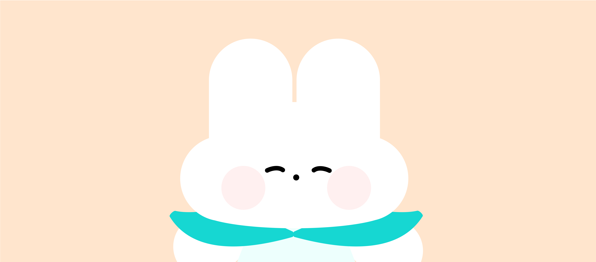

# 🌸 Pida Server

---

##  🚀 **Tech Stack**

- **Language & Framework**:
    - Spring Boot 3.4.x
    - Java 21
    - Kotlin 2.1.x

- **Data Access**:
    - Spring Data JPA
    - Kotlin JDSL
    - PostgreSQL 17.2 (+ PostGIS)
    - Redis 7.1.0

- **External API Client**:
    - OpenFeign

- **Build Tool**:
    - Gradle 8.12.1

- **Code Quality & Style**:
    - ktlint

---

## 🗺️ Cloud Architecture

- 컨테이너 환경: **AWS ECS + Fargate**
- 데이터베이스: **AWS RDS (PostgreSQL)**
- 캐시 관리: **AWS ElastiCache (Redis)**

> _클라우드 아키텍처 이미지 추가 예정_

---

## 🏰 **Architecture Overview**

### 📌 **Presentation Layer** (`:core:core-api`)
- 사용자 요청 처리 및 응답
- Spring Boot Application, Controllers
- 주요 Annotation: `@RestController`, `@Configuration`

### 📌 **Business Layer** (`:core:core-domain`)
- 순수 비즈니스 로직을 담당하는 서비스 계층
- 서비스의 세부 구현 로직을 모듈화하여 담당
- 주요 Annotation: `@Service`, `@Component`

### 📌 **DataSource Layer** (`:storage`)
- 실제 데이터 소스 관리 및 DB 제어
- 주요 Annotation: `@Entity`, `@Repository`, `@Transactional`

### 📌 **Clients Layer** (`:clients`)
- 외부 시스템과의 연동 및 API 호출 관리
- 주요 Annotation: `@FeignClient`, `@EnableFeignClients`
- 예시: 알림 서비스, 외부 API 통합

### 📚 **Other Modules**

#### 🔖 Support

- logging: Logback 기반 로그 관리

- monitoring: 애플리케이션 모니터링

- swagger: OAS 기반의 API 문서화 및 스펙 제공

#### 🧪 Tests

- api-docs: Spring Rest Docs를 활용한 API 명세 자동화

- test-container: TestContainers 기반의 독립적이고 멱등성 높은 데이터 소스 테스트 환경

- test-helper: Naver Fixture Monkey를 활용한 테스트 데이터 생성 및 관리

